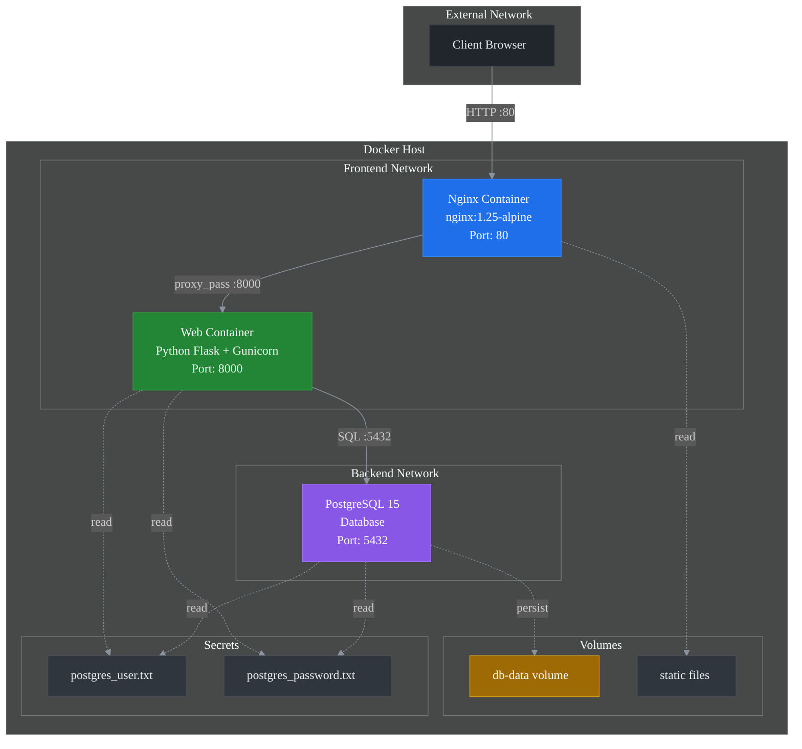

# KNESS Test – Dockerized App Bootstrap

Цей репозиторій запускається на чистому сервері **одним bash-скриптом**, який автоматично:
- встановлює Docker + Docker Compose
- клонить репозиторій
- піднімає docker-compose стек
- налаштовує UFW
- створює Docker secrets для PostgreSQL
- перевіряє health через `curl`

Підтримується **тільки Ubuntu**.

---

## 📦 Що робить скрипт

1. Перевіряє, що ОС — Ubuntu
2. Оновлює `apt` та ставить базові пакети
3. Встановлює Docker Engine та Docker Compose Plugin
4. Запускає та вмикає Docker
5. Створює або перевіряє користувача для роботи з Docker
6. Клонує репозиторій у `/opt/app`
7. Створює secrets для PostgreSQL:
   - `postgres_user.txt`
   - `postgres_password.txt`
8. Запускає:
   ```bash
   docker compose up -d --build
   ```
9. Відкриває порти 80/tcp і 22/tcp, якщо активний UFW.
10. Робить локальний health-check

⚙️ Вимоги
Ubuntu 20.04 / 22.04 / 24.04
Root-доступ (sudo або root)
Інтернет

🚀 Як запустити
1. Скопіюй скрипт на сервер
  ```bash
   nano default.sh
```
Встав скрипт, збережи файл.

2. Зроби його виконуваним
```bash
chmod +x default.sh
```
3. Запусти від root
```bash
sudo ./default.sh
```
⚠️ Обовʼязково запускати від root, інакше:
Docker не встановиться
користувач не додасться до групи docker
UFW не налаштується

👤 Користувач Docker

За замовчуванням використовується користувач:
```bash
syshmaks
```

Якщо потрібно інше імʼя:
```bash
export DOCKER_USER=myuser
sudo ./default.sh
```



